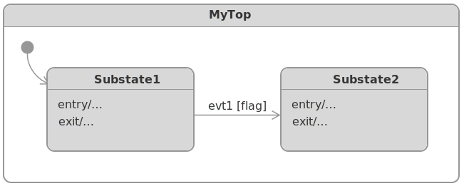

# HSM

__UML statecharts__ (__Hierarchical State Machine__) framework implementation in _Swift_ (_Disclaimer: the framework is under development and is subject to change._)

<p>
    
    
    
    <a href="https://github.com/SergeBouts/Mitra/blob/master/LICENSE">
        
    </a>
</p>


## Contents

- [Intro](#intro)
- [Features](#features)
- [Usage](#usage)
- [Demos](#demos)
- [Installation](#installation)
- [License](#license)
- [Resources](#resources)

## Intro

__User Interface__ (_UI_) - provides the interaction between people and machines. A good user interface is _simple_, _efficient_, _enjoyable_, _ergonomic_, and _intuitive_ (_user-friendly_).

The first _UI_ in which people interacted with a computer system in real time was the command line interface (_CLI_). It was a simple _UI_ in terms of implementation, where the user had to type commands that the system would execute. In order to _interact_ with the system, the user had to know the command language. And users were responsible for making sure that the _interaction syntax_ was always correct.

With the development of computer graphics, another class of _UI_'s emerged: _Direct Manipulation Graphical User Interfaces_ (_GUI_'s), which are much easier to use than _CLI_, because the user does not need to know the command language to _interact_ with the system. Instead, individual graphical elements such as _buttons_, _scrollbars_, and _windows_ represent different program entities, and the user can directly _interact_ with these entities without having to type commands. This _UI_ allows the user to _interact_ effectively with the system without any prior knowledge of the interface. _UI_'s with direct manipulation are easy to use because the state of the object is visible to the user and the user can manipulate the object directly.

_GUI_ software is built on top of a _reactive application framework_ (a _supervisory event-driven infrastructure_) with _business logic_ _actions_ performed _asynchronously_ in _event handler callbacks_. Control resides in the _event-driven infrastructure_, so from the application standpoint the control is _inverted_ compared to a traditional sequential program (as in the case of the old _batch-interface_ software).

Each _GUI_ object can respond to external _events_, such as those coming from the user (as part of the _user interaction_), the operating system, or the application itself. The sequence of events entering the application determines the control flow. The developers are responsible for ensuring the syntax of the control flow (including the _user interaction_) is always correct.

The correct (expected) _control flow_ consists of _valid event orderings_ or "_happy paths_". The problem is, as the number of possible _events_ increases, the number of "_unhappy paths_" (_unexpected orderings of events_) has a _factorial_ growth and it quickly outgrows the _capacity of the human mind_, and there always comes a point where _bugs_ are inevitable.

_UI_ developers face the challenge of ensuring that all _UI_ objects and dialogs in the application are coordinated in such a way that it is impossible for a user to perform operations that would lead to an _error_. _UI_ objects do not behave independently of each other and the developer is responsible for ensuring that a user can only supply valid _events_ at any given time. In fact, the _events_ a user supplies (when _interacting_ with the _UI_) cause the application to move from one set of possible events to another. In other words, the _UI_ moves from one _state_ to another, and the _state_ defines the set of possible _events_ a user can supply. The _states_ define the _context_ in which an _event_ occurs. Mostly, the _states_ are not _explicitly_ specified in the _UI_ code. However, if these _states_ were to be represented on a _diagram_ _explicitly_ and used as the basis for constructing the _control layer_ objects, the _UI_ would be much easier to build.

 This is where the _event-state-action_ paradigm (as opposed to the oversimplified _event-action_ paradigm) comes in, leading to such a technique as _Finite State Machine_ (_FSM_). But for a long time, the idea of building a real UI-based project on _FSM_ was not considered viable because of the problem known as the _state explosion problem_ (large number of states and event arrows) that occurs when using _state transition diagrams_ as the _design notation_ for designing any but trivial _UI_'s. This problem was later addressed by _UML statechart notation_ (originally proposed by _David Harel_), which is essentially a hierarchical extention to the _FSM_, _Hierarchical State Machine_ (_HSM_).

Here are some facts about _UML statecharts_:

- The use of _UML statecharts_ naturally leads to the use of a _top-down approach_ to _behavior modeling_, where the most general/abstract _behavior_ is first introduced, and then the subtleties of that behavior are refined through _programming by difference_. This is also the key to the long-term _maintainability_ of such software.
- The power of _UML statecharts_ is based on the _reuse of behavior_. The same idea is used in _Ultimate Hook_ pattern, which is common in _GUI_'s, or _Chain of Responsibility Pattern_. The active _sub-state_, which is at a lower level of the _state hierarchy_, has the ability to respond first to each _event_; thus it can choose to react in any way it likes. At the same time, all unhandled _events_ bubble up to the higher level, where they are processed according to the more general _behaviors_ of the _super-states_. This is an example of _programming by difference_ because the _UI_ programmer needs to code only the differences from the more general _behaviors_.
- _UML statecharts_ have been invented as “a visual formalism for complex systems”, so from their inception, they have been inseparably associated with graphical representation in the form of _state diagrams_. The best way to capture the precise behaviour of a _UI_ is to produce a model of the _UI behaviour_ in a graphical language that has well-defined semantics. In addition, _UML statecharts_ are an excellent means of communication between technical and non-technical members of the project team.
- _UML statecharts_ technology was fundamentally used in Nasa's _Deep Space 1 (DS1) Mission_ and _Mars Science Lab (MSL) Mission_. For example, code automatically generated from a _state machine diagram_ has been part of _Curiosity_’s flight software since launch, and continues to run onboard today.

This framework was developed as part of a exploration of different architectures for structured behavior modeling in the development of the _UI_ control layer in _Swift_.

## Features:
- UML standard compliance was in mind (but not yet reached full complienсe)

- Hierarchical states with full support for behavioral inheritance

- Orthogonal regions

- State entry and exit actions for initialization and cleanup and also transition actions

- Internal and external self-transitions

- Initial, fork and join pseudostates

- History mechanism (both shallow and deep history)

- Actor (active object) model

- Run-To-Completion model

- Extended state support, and etc
  
  

The framework was developed with the following aspirations:

- It should be simple to use and maintain. Defining state should be as easy as defining OOP classes.
- It should allow for easy changes in the state machine topology (state nesting and state transitions). No manual coding of transition chains should be required.
- It should provide good runtime efficiency and take up little memory. The cost of dispatching events in a state machine should be comparable to calling virtual functions in OOP.
- It should be as UML-compliant as possible.
- The verbosity of the code for using the state machine should be reduced as much as possible.

Note: These requirements often contradict each other, so this implementation strives to achieve a balanced implementation.

Further development objectives:
- Improving syntax and modernizing the API
- Achieving full automatic scoping of the extended state
- Implementing composite state's encapsulation (by means of entry/exit point)


## Usage

An understanding of Harel's statecharts and their concepts is required for work with this framework. At the end of this page you will find some links to resources on this topic.

Consider the following statechart diagram:



You can represent this diagram in the framework with the following code:

```swift
class MyTop: TopState<MyEvent> {
    class Substate1: State<MyTop, MyTop> {
        override func entry() { ... } // optional
        override func exit() { ... } // optional
        override func handle(_ event: MyEvent) -> Transition? { // optional
            switch event {
                case .evt1(let flag) where flag:
                    return Transition(to: superior.substate2)
                default:
                    return nil
            }
        }
    }
    let substate1 = Substate1()

    class Substate2: State<MyTop, MyTop> {
        override func entry() { ... } // optional
        override func exit() { ... } // optional
        override func handle(_ event: MyEvent) -> Transition? { ... } // optional
    }
    let substate2 = Substate2()

    override func initialize() {
        bind(substate1, substate2)
        initial = substate1 // optional
        historyMode = .shallow // optional
    }
}
```

Here we have a top state `MyTop`  which is a _composite_ state and it's parameterized by our event type `MyEvent`. The `MyTop` contains 2 sub-states `Substate1` and `Substate2`. All sub-states in the framework have the same structure. A substate must be explicitly parameterized with two types: (1) its immediate superior state, the immediate container (or parent), (2) and the top state (which is always the most superior state). This serves to bind all state types nested in the hierarchy of states, and to enable statically referring to the immediate superior and topmost state from event handlers and state reactions; for this each state has 2 properties `superior` and `top`.

Each state must bind its sub-states in the `initialize()` method, passing them as arguments in the `bind(...)` call. The `initialize()` method is also the method in which you configure _initial_ (or default) sub-state as well as the state _history mode_.


# Demos

Here are simple demo apps so that you can try and hands-on experiment with the framework yourself.

## [HSM-based running lights demo](https://github.com/SergeBouts/HSMRunningLightsDemo)

Statechart diagram:


Here's the source code of the HSM-based application controller for the above statechart diagram:


```swift
import Foundation
import HSM

/// HSM-based controller
class Controller: TopState<Event> {
    // MARK: - Substates

    class Lights: State<Controller, Controller> {
        class Red: State<Lights, Controller> {
            override func entry() {
                top.actions.turnOnRedLed()
            }
            override func exit() {
                top.actions.turnOffRedLed()
            }
            override func handle(_ event: Event) -> Transition? {
                switch event {
                case .timerTick: return Transition(to: superior.green)
                default: return nil
                }
            }
        }
        let red = Red()

        class Green: State<Lights, Controller> {
            override func entry() {
                top.actions.turnOnGreenLed()
            }
            override func exit() {
                top.actions.turnOffGreenLed()
            }
            override func handle(_ event: Event) -> Transition? {
                switch event {
                case .timerTick: return Transition(to: superior.blue)
                default: return nil
                }
            }
        }
        let green = Green()

        class Blue: State<Lights, Controller> {
            override func entry() {
                top.actions.turnOnBlueLed()
            }
            override func exit() {
                top.actions.turnOffBlueLed()
            }
            override func handle(_ event: Event) -> Transition? {
                switch event {
                case .timerTick: return Transition(to: superior.red)
                default: return nil
                }
            }
        }
        let blue = Blue()

        // MARK: - Initialization

        override func initialize() {
            bind(red, green, blue)
            initial = red
            historyMode = .shallow
        }

        // MARK: - Lifecycle

        override func entry() {
            top.actions.clear()
        }

        override func handle(_ event: Event) -> Transition? {
            switch event {
            case .buttonTap: return Transition(to: superior.paused)
            default: return nil
            }
        }
    }
    let lights = Lights()

    class Paused: State<Controller, Controller> {
        override func handle(_ event: Event) -> Transition? {
            switch event {
            case .buttonTap: return Transition(to: superior.lights)
            default: return nil
            }
        }
    }
    let paused = Paused()

    // MARK: - Properties

    let actions: Actions

    // MARK: - Initialization

    init(actions: Actions) {
        self.actions = actions
    }

    override func initialize() {
        bind(lights, paused)
        initial = lights
    }
}

```

## [HSM-based calculator demo](https://github.com/SergeBouts/HSMCalculatorDemo)

Statechart diagram:


Examine the source code of the HSM-based application controller for the above statechart diagram [here](https://github.com/SergeBouts/HSMCalculatorDemo/blob/master/HSMCalculator/Controller.swift).

## Installation

### Swift Package as dependency in Xcode 11+

1. Go to "File" -> "Swift Packages" -> "Add Package Dependency"
2. Paste HSM repository URL into the search field:

```
https://github.com/SergeBouts/HSM.git
```

1. Click "Next"
2. Ensure that the "Rules" field is set to something like this: "Version: Up To Next Minor: 0.11.1"
3. Click "Next" to finish

For more info, check out [here](https://developer.apple.com/documentation/xcode/adding_package_dependencies_to_your_app).

## License

This project is licensed under the MIT license.

## Resources

- [Awesome Finite State Machines](https://github.com/leonardomso/awesome-fsm)
- [David Harel - Statecharts: A Visual Formalism for Complex Systems](https://www.wisdom.weizmann.ac.il/~dharel/SCANNED.PAPERS/Statecharts.pdf)
- [David Harel - Statecharts in the Making: A Personal Account](http://www.wisdom.weizmann.ac.il/~harel/papers/Statecharts.History.pdf)
- [Ian Horrocks - Constructing the User Interface with Statecharts](https://www.amazon.com/gp/product/0201342782)
- [Miro Samek - Practical UML Statecharts in C/C++: Event-Driven Programming for Embedded Systems](https://www.amazon.com/Practical-UML-Statecharts-Event-Driven-Programming/dp/0750687061)
- [OMG - Unified Modeling Language (UML)](https://www.omg.org/spec/UML/2.5.1/PDF)
- [Statecharts](https://statecharts.dev/)
- [The Statechart Perspective](http://homepage.cs.uiowa.edu/~fleck/181content/statecharts.pdf)
- [UML Statechart Autocoding for the Mars Science Lab (MSL) Mission](https://trs.jpl.nasa.gov/bitstream/handle/2014/43235/12-5232_A1b.pdf)
- [Wiki - UML State machine](https://en.wikipedia.org/wiki/UML_state_machine)
